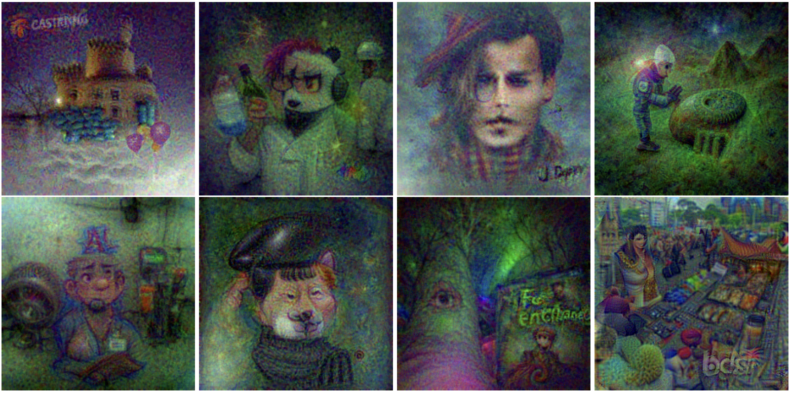

[//]: # (# CLIPInversion)
# What do we learn from inverting CLIP models?
**<span style="color:white">Warning</span>: This paper contains sexually explicit images and
language, offensive visuals and terminology, discussions on
pornography, gender bias, and other potentially unsettling,
distressing, and/or offensive content for certain readers.**

[Paper](https://arxiv.org/abs/2403.02580)


**Installing requirements:**


```bash
pip install requirements.txt
```
**How to run:**


```bash
python invert.py \
    --num_iters 3400 \  # Number of iterations during the inversion process.
    --prompt "The map of the African continent" \  # The text prompt to invert.
    --img_size 64 \  # Size of the image at iteration 0.
    --tv 0.005 \  # Total Variation weight.
    --batch_size 13 \  # How many augmentations to use at each iteration.
    --bri 0.4 \  # ColorJitter Augmentation brightness degree.
    --con 0.4 \  # ColorJitter Augmentation contrast degree.
    --sat 0.4 \  # ColorJitter Augmentation saturation degree.
    --save_every 100 \  # Frequency at which to save intermediate results.
    --print_every 100 \  # Frequency at which to print intermediate information.
    --model_name ViT-B/16 # ['RN50', 'RN101', 'RN50x4', 'RN50x16', 'ViT-B/32', 'ViT-B/16']
```
